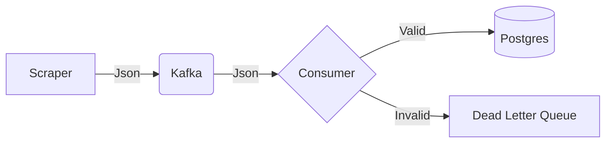

# Day 55: The Documentation (README)

**Objective:** Explain your genius.
**Significance:** Recruiters don't run code. They read READMEs.

---

## 1. Structure of a Great README
Don't just write "Run python main.py".
Write a **Report**.

### Section A: The Architecture
"This project uses a decoupled microservices architecture."
*   **Producer:** Scrapes data using `curl_cffi` (impersonating Chrome 124) to bypass Cloudflare. Pushes to Kafka.
*   **Buffer:** Redpanda (Kafka) queues messages to handle backpressure.
*   **Consumer:** Reads from Kafka, validates schema with `Pydantic`, saves to Postgres.
*   **Orchestrator:** Airflow manages the daily schedule and handles retries.

### Section B: The Anti-Bot Strategy
Explain *how* you solved the hard part.
"I used TLS Fingerprint spoofing to mimic a real browser. I analyzed the `api/poll` endpoint to avoid Javascript execution, saving 90% CPU."

### Section C: Instructions
```bash
docker-compose up --build
```

## 2. Generate a Diagram
Use [Mermaid.js](https://mermaid.live) in your README.



## 3. Homework
1.  Write the README.md.
2.  Include the Diagram.
3.  Include Screenshots of the Dashboard (Day 53).
4.  Include a screenshot of the "Blocked" page vs the "Success" page.
